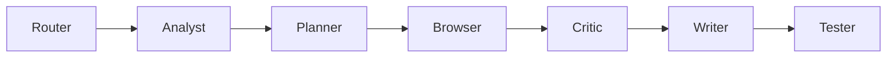

# Agentic Pipelines

## 1. Facebook Group Sync

Purpose: discover groups, scan each group, validate posts, and upsert rows.

Flow:

Steps:

1. Confirm `ENABLE_AGENTIC_FACEBOOK_SYNC=true`.
2. Build discovery query from `BROWSER_SEARCH_QUERY`.
3. Build in-group phases from `BROWSER_IN_GROUP_SEARCH_QUERY` or request payload.
4. Parse `BROWSER_SEED_GROUP_URLS`; scan seeds before discovery groups.
5. Run browser discovery up to `BROWSER_GROUP_SCAN_LIMIT`.
6. Extract up to `BROWSER_POST_LIMIT_PER_GROUP` posts per group and phrase.
7. Critic drops duplicates, wrong-query misses, and posts failing publication filters.
8. Writer upserts with source `playwright_agentic`.

## 2. Keyword Search

Purpose: focus on one phrase across known or discovered groups.

Inputs:

- `query`
- `in_group_query`
- optional `global_message_contains`
- optional seed group list

Success output includes `flow=agentic_facebook`, `groups_scanned`, `found_posts`, `upserted`, `artifacts_dir`, and `html_report_dir`.

## 3. Daily Report

Purpose: use the existing report system after agentic sync has stored posts.

Flow:

1. Run the agentic sync.
2. Check `upserted` and `found_posts`.
3. Run the existing daily report endpoint or script.
4. Attach the agentic HTML report path for operator review.

The report builder reads from the shared `posts` table, so rows with source `playwright_agentic` appear with the rest of the stored posts.

## 4. Debug And Retry

Purpose: recover from login failures, checkpoints, layout shifts, or extraction errors.

Flow:

1. Inspect `errors`, `artifacts_dir`, and `html_report_dir`.
2. Open the latest snapshot/screenshot for the failed group.
3. Retry with fewer groups or only seed groups.
4. Increase `BROWSER_SEARCH_TIMEOUT_SECONDS` for manual login or 2FA.
5. If Facebook UI changed, update the browser extraction primitive in the isolated agentic package or shared helper only when the classic flow remains compatible.
